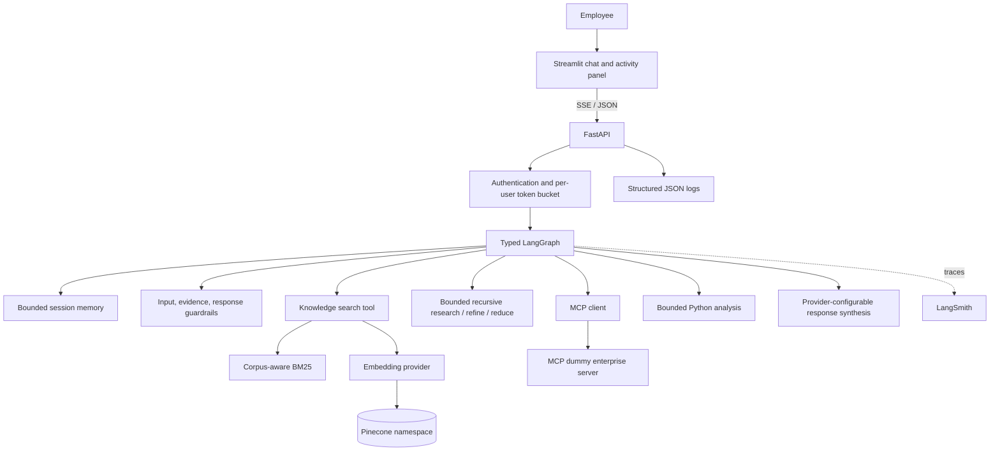
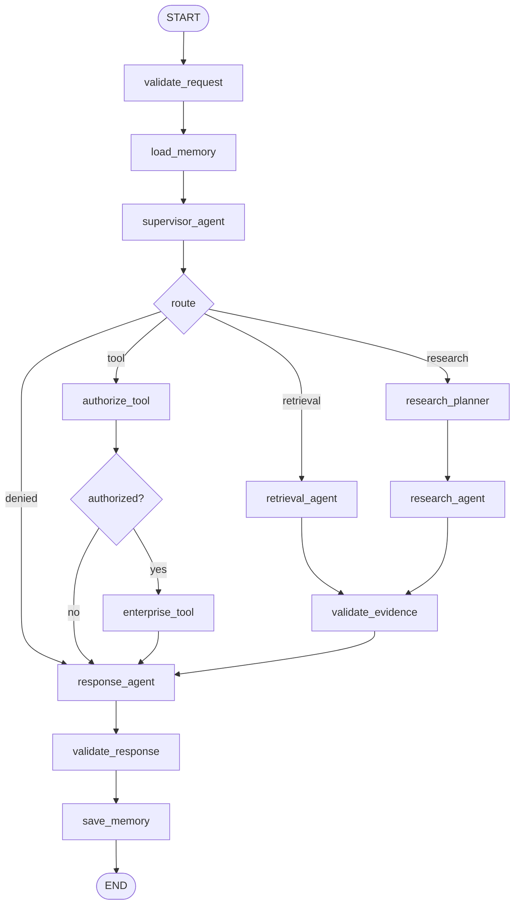

# Architecture

The system is a modular monolith. One policy boundary owns authentication, graph orchestration, retrieval, tools, validation, and observable events. External providers sit behind adapters so the credential-free development profile and Pinecone/OpenAI/LangSmith integration profile use the same graph.

## Component view

## Compiled graph

## State and boundaries

`AgentState` contains execution facts: authenticated identity, normalized request, route, memory context, search plan, evidence, tool requests/results, citations, validations, errors, and activity. It does not contain hidden model reasoning.

Security decisions are deterministic:

1. FastAPI derives identity from the bearer token.
2. Input guardrails can route to safe denial.
3. Retrieval compiles the role into document-access filters.
4. Tool authorization is checked immediately before execution.
5. Evidence and citation IDs are validated before release.

## Retrieval

Markdown is parsed into heading-level chunks with stable `document_id`, `chunk_id`, section, department, type, classification, date, and source URI. Local sparse scoring uses BM25 with corpus document frequency. Dense scoring uses configured embeddings or a deterministic offline fallback. Scores are normalized and fused with a configurable weight. Pinecone queries use the environment namespace and server-derived classification/type filters.

## RLM controls

Complex requests begin with bounded subqueries. At each depth, retrieval branches run concurrently with a semaphore and tolerate partial branch failure. The research agent inspects accumulated evidence for referenced records, missing incident sections, and recurring evidence terms, then recursively invokes the next research iteration with targeted refinement queries. `MAX_RLM_DEPTH`, `MAX_RLM_SUBQUERIES`, `MAX_RLM_DOCUMENTS`, per-call deadlines, and chunk-level deduplication bound the work. Each iteration has its own LangSmith child span and live activity events. The compiled graph remains acyclic while the research node performs bounded internal recursion.

## Reliability

- Per-call retrieval, tool, and graph deadlines.
- Partial research results survive failed branches.
- Pinecone failure degrades to local hybrid retrieval.
- Missing evidence produces an explicit abstention.
- Stable HTTP/SSE error events prevent raw exception exposure.
- One worker is required while memory and limits are process-local.

The comprehensive target architecture, trade-offs, failure matrix, and growth plan are maintained in [CONTEXT_PROJECT_DESIGN.md](CONTEXT_PROJECT_DESIGN.md).
